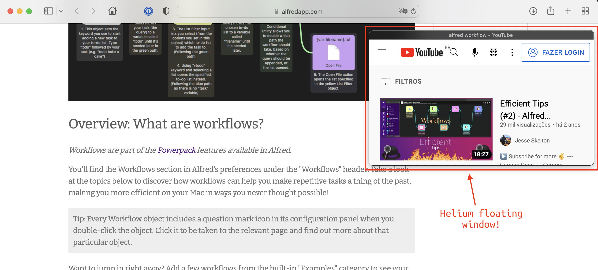
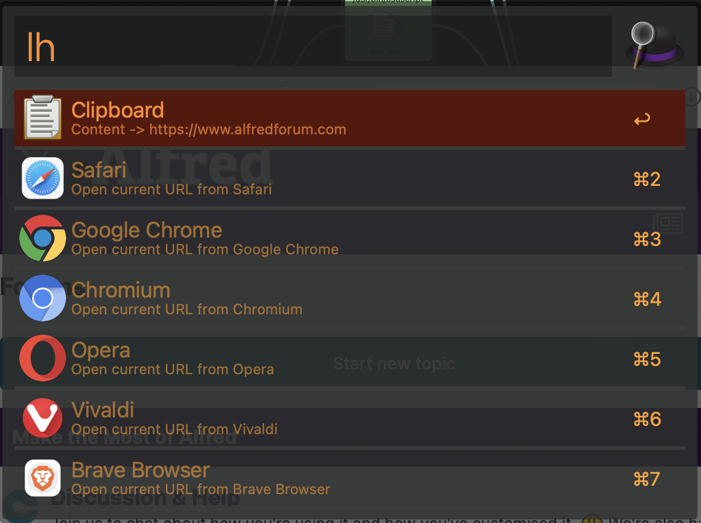
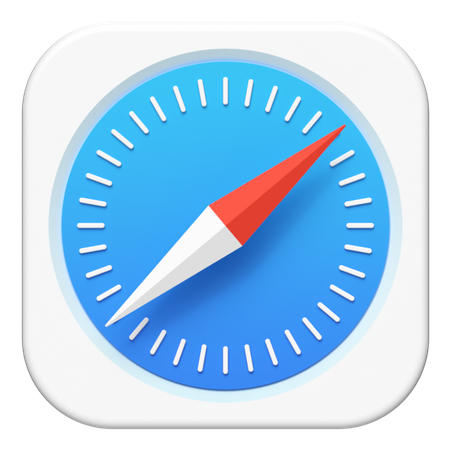

# Alfred-Load-In-Helium
An Alfred workflow to open current browser or clipboard url on [Helium](https://apps.apple.com/app/helium/id1054607607?mt=12).

Helium is a floating browser that stays allways on top of other windows and allows you to whatch media while do other stuff.  

  
   

## Permissions
The first time you use this workflow with one of the supported browsers it will ask you for permissions to interact with the browser to get its current URL.  
## Usage
Just type `lh` (load helium) on alfred and the workflow will list the options based on your current open browsers.

  

## Supported Browsers
Actually the following browsers are supported:  
  

## Download
To download the workflow check the [Releases page](https://github.com/gohoyer/Alfred-Load-In-Helium/releases).